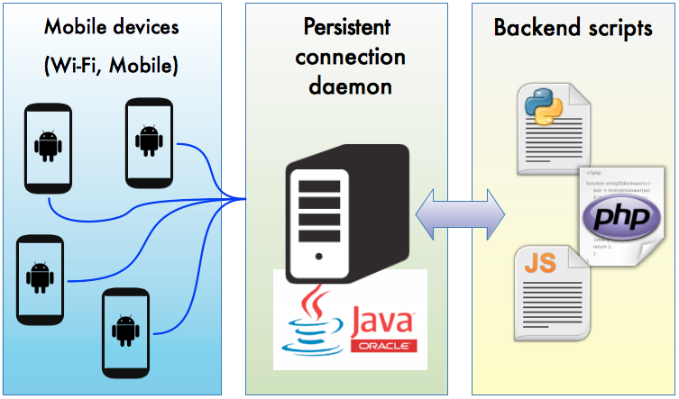

Persistent Connection Daemon
============================

A persistent connection daemon for **mobile devices** written in java. 
Sometimes we need to keep track of mobile devices connected to our services for sending or retrieve data. 
It's difficult to keep a persistent connection due to the mobility of smartphone (the device often change network). 
For solve this problem I've developed this Daemon that keep active a sockets between the devices and the Daemon.
Whenever you need to send a command (or data) from your backend script (PHP, Python, Javascript, ...) to a mobile Device
you only need to ask to the Daemon to do it for you (via a JSON command).


The image below explain the infrastructure of the system:



How To Get Started 
==================

Daemon
---------
1. Open the NetBeans project and setup the right configuration in ```Config.java```
2. Compile the daemon (Run > Clean and Build Project)
3. Start it using ```java -jar PCDaemon.jar 2>&1 /var/log/PCDaemon.log```
4. Check logs using ```tail -f /var/log/PCDaemon.log```

Backend Script
---------
Check the basic **PHP** script available [here](/scripts/send-cmd.php) and create your own implementation.
This is really a **basic script** that only send a basic command to a Device without managing the possibile errors 
returned by the daemon (no connected device, errore while sending command, ...).

Mobile (Android implementation)
For implementing a persistent connection in Android I've followed this [blog page]{http://devtcg.blogspot.it/2009/01/push-services-implementing-persistent.html}
and modified the [**TestKeepAlive** project]{http://code.google.com/p/android-random/source/browse/#svn/trunk/TestKeepAlive}.

The major edit you have to do is inside the class ```KeepAliveService.java``` removing code between line 397 and 402
and adding the line
 ```java
 out.write(getAuthString().getBytes());
 ```
 
 where the function ```getAuthString()``` is defined like
```Java
private String getAuthString() {
	/* Settings is a singleton that contains all the information about this device */
	Settings mySettings = Settings.getInstance();
	JSONObject jsonAuth = new JSONObject();
	try {
		jsonAuth.put("identifier", mySettings.getIdentifier);
		jsonAuth.put("networkType", mySettings.getNetworkType);
		jsonAuth.put("model", mySettings.getModel());
		jsonAuth.put("keepAliveInterval", mySettings.getKeepAliveInterval);
	} catch (JSONException e) {
		return "ERROR";
	}
	return jsonAuth.toString();
}
```
---------

JUnit Tests
---------
**JUnit tests** are available [here](PC-daemon/test/com/brunocapezzali).

License 
---------
Persistent Connection Daemon (PC-daemon) is available under the MIT license. See the LICENSE file for more info.